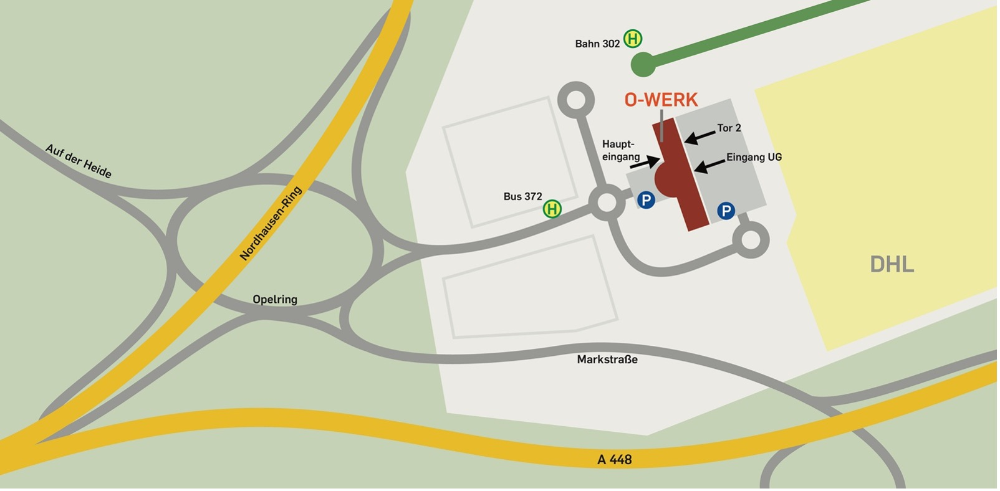

# 2023 in Bochum

2023 wird Fab:UNIverse am **23. und 24. November** im [RUB-Makerspace](https://makerspace.rub.de) an der [Ruhr-Uni Bochum](www.rub.de) stattfinden.

Wie im letzten Jahr wird Fab:UNIverse zweitägig sein und der Fokus wird auf aktivem - aber letztlich spontanem und von den Teilnehmer\*Innen getriebenem - Austausch liegen. Zusätzlich gibt es die Möglichkeit, strukturiertere Beiträge einzureichen. Auch fürs Abend-Programm und das leibliche Wohl wird gesorgt sein. 

## Call for Contributions

Die Fab:UNIverse ist keine klassische "Paper-Konferenz", sondern vor allem eine Möglichkeit zur Begegnung und zum Austausch. Trotzdem freuen wir uns natürlich über Beiträge, die für die Community von Interesse sind. [Workshops](#workshops), Vorträge, Tanzperformance - der Fantasie sind kaum Grenzen gesetzt. 

Wer etwas beitragen möchte, darf das natürlich auch in diesem Jahr sehr gerne tun! Input diesbezüglich bitte einfach an [Oliver Stickel](https://oliverstickel.de) schicken.

## Anmeldung

Bitte melde Dich für die Teilnahme an der Fab:UNIverse 2023 an. Wie immer ist die Tagung kostenlos. 

[Hier geht's zur Anmeldung](https://pretix.eu/fabuniverse/fabuniverse2023/){ .md-button }

## Programm 2023

Hier findet ihr das (Rahmen-)Programm, das bis zur Tagung laufend mit neuen Beiträgen/Einreichungen ergänzt wird.

### 23.11.2023

**Ab 09:00 Uhr**		Eintreffen & Frühstück

**10:00 - 10:30 Uhr**   Begrüßung

**10:30 - 13:00 Uhr**	Vorstellungsrunde

**13:00 - 14:00 Uhr**	Pause und Mittagessen

**14:00 - 16:30 Uhr**	Zeit für Vorträge, [Workshops](#workshops) und andere Einreichungen aus dem Call for Contributions (oder spontan)

**16:30 - open end**    Offener Austausch, Fachgespräche und Get-together in allen Bereichen / Werkstätten im RUB-Makerspace

**Ab 18:30**            Grillen und Kaltgetränke

### 24.11.2023

**08:30 - 09:30 Uhr**	Frühstück

**09:30 - 12:00 Uhr**	[Workshops](#workshops) und ggf. andere Einreichungen aus dem Call for Contributions

**12:00 - 13:00 Uhr**	Wrap-up

**Ab 13:00 Uhr**	Gemeinsames Mittagessen & Ausklang

## Workshops und Vorschlag zum Ablauf

Die genaue Zeitplanung und Zuteilung zu den Workshops machen wir gemeinsam an Tag 1, zumal die Workshops unterschiedlich lange oder kurz brauchen werden. Der eine oder andere Workshop wird je nach Interessenslage der konkreten Teilehmer\*Innen wohl auch zusammengelegt werden. Wer möchte, kann natürlich im Vorfeld gern bereits in Kontakt zu den organisierenden Menschen treten.

### Tag 1

**Themenblock Infrastruktur**

**WS1:** Stand von und Hands-on mit [Fab Access](https://fab-access.org/). Organisation: [Tasso Mulzer](https://www.bht-berlin.de/people/detail/1487).

**WS3:** Einführung und Hands-on mit [VisiCut](https://visicut.org/). Organisation: [Jan Borchers](https://hci.rwth-aachen.de/borchers) und [Anke Brocker](https://hci.rwth-aachen.de/brocker).

**Themenblock Bildung** 

**WS5:** Lehr- und Lernformate im Makerspace (insb. Sammlung von Methoden und Konzepten). Organisation: [Eva Ismer](https://www.th-wildau.de/personen/eva-ismer/).

**WS8:** Round Table: Fab Labs / Makerspaces und  MINT/STEAM. Organisation: [Marios Mouratidis](https://www.cscw.uni-siegen.de/team/marios-mouratidis/).

**WS9:** Fab Lab und Schule: Berichte aus der praxisnahen Forschung und Diskussion von Herausforderungen. Organisation: [Iris Bockermann](https://dimeb.informatik.uni-bremen.de/index.php?id=184).

### Tag 2

**Themenblock Infrastruktur**

**WS4:** Kunststoff-Recycling mit Wissen und Maschinen von [Precious Plastic](https://preciousplastic.com/). Organisation: [Al Buchwald / Kunststoffwerkstatt RUB-Makerspace](https://makerspace.ruhr-uni-bochum.de/team/#digitallabor-und-kunststoffwerkstatt).

**Themenblock Organisationsentwicklung und Selbstreflexion**

**WS2:** Drittmittelanträge, Fundraising, Finanzierung. Organisation: [Florian Krohm](https://makerspace.ruhr-uni-bochum.de/team/#fkb).

**WS6:** Ein Website-Prototyp für Fab:UNIverse. Stand und Demo/Hands-on zur Bearbeitung. Organisation: [Tasso Mulzer](https://www.bht-berlin.de/people/detail/1487) und [Oliver Stickel](https://oliverstickel.de).

**WS7:** Quo vadis, Fab:UNIverse? VOW-Arbeitsgruppe? Geschäftsstelle? Weiter wie bisher? Organisation: [Maik Jähne](https://www.slub-dresden.de/ueber-uns/kontakte-und-ansprechpersonen/maik-jaehne).

**WS10:** Macht- und Hierarchiestrukturen in Fab Labs und Makerspaces. Organisation: [Oliver Stickel](https://oliverstickel.de)

## Kontakt und Organisation

Alle Anliegen zur übergeordneten Organisation und zum Programm von Fab:UNIverse 2023 bitte an [Oliver Stickel](https://oliverstickel.de). "Local Chair", also Repräsentant für alle Anliegen unserer diesjährigen Gastgeberin, der Ruhr-Universität Bochum, ist [Florian Krohm](https://einrichtungen.ruhr-uni-bochum.de/de/florian-krohm-brauckmann). 

## Übernachten

#### Camping / im RUB-Makerspace

Nachdem in [Halle](2022.md) so gut vorgelegt wurde, soll es auch in 2023 wieder möglich sein, direkt vor Ort zu übernachten und so auch am Abend noch entspannt zusammensitzen zu können. Dafür gibt es folgende Möglichkeiten: 

- Zelt im Innenhof des Makerspace. Aber Achtung, der Hof ist gepflastert. Euer Zelt muss also entweder selbsttragend sein oder ihr bringt Sandsäcke statt Heringen o.Ä. mit.
- Camper auf dem Parkplatz. Für Strom kann gesorgt werden.
- Übernachten im Makerspace. Wir haben ein paar gemütliche Projekträume, in denen es sich mit Luftmatratze und Schlafsack auch übernachten lässt. Man muss allerdings damit rechnen, dass es dank Notbeleuchtung nie wirklich dunkel wird und dass man ggf. früh morgens geweckt wird. 

Duschen und Toiletten im Makerspace können bei allen Übernachtungsvarianten genutzt werden. 

#### Hotels

Für alle, die es etwas konventioneller haben wollen, gibt's in der Innenstadt von Bochum im Umkreis um den Hauptbahnhof verschiedenste Hotels und Jugendherbergen. Die Anbindung zum Makerspace per ÖPNV vom dort aus ist dank der Straßenbahn problemlos. 

Das einzige Hotel, das wirklich direkt um die Ecke liegt, ist das [Rittergut Haus Laer](https://www.rittergut-haus-laer.de/).

[Hier](https://www.ruhr-uni-bochum.de/relwiss/dvrw/unterkunft.html) findet ihr eine Liste von Hotels einer ganz anderen Tagung an der RUB, die zwar schon etwas älter ist, aber immer noch eine ganz gute Auswahl der Häuser im passenden Preisbereich für Reisekostenerstattungen darstellt.

## Anreise

#### Anschrift für die Anreise

    O-Werk, RUB-Makerspace,   
    Suttner-Nobel-Allee 4,  
    44803 Bochum

An den beiden Haupteingängen vor und hinter dem Gebäude sind vor den Eingangstüren Säulen mit Klingeln. Bitte klingle bei "RUB-Makerspace" falls die Eingangstüren nicht geöffnet sind.

#### Karte der Umgebung

<small><a href="https://www.openstreetmap.org/#map=19/51.46539/7.25983">Größere Karte auf openstreetmap.org anschauen</a></small>

#### Anreise per ÖPNV  

Direkt neben unserem Gebäude liegt die Straßenbahn-Haltestelle *O-Werk* und am Kreisverkehr vor dem Gebäude die gleichnamige Bushaltestelle. Die Haltestellen werden von diesen Linien angefahren:

- *Straßenbahn Linie 302:* O-Werk - BO-Hbf - Gelsenkirchen.
- *Bus Linie 372:* BO-Querenburg - Laer - Langendreer West - Werne.

[Aktuelle Abfahrtszeiten "O-Werk" auf bahn.de](https://reiseauskunft.bahn.de/bin/bhftafel.exe/dn?ld=4329&country=DEU&protocol=https:&rt=1&input=O-Werk,%20Bochum%23375967&boardType=dep&time=actual&productsFilter=1111111111&start=yes&){ .md-button }

#### Anreise mit dem Auto

Der RUB-Makerspace ist für Autofahrer\*innen gut angebunden. Über die A40, A43 oder A44 kommst Du bequem auf die A448 und dort über die Ausfahrt "Bochum-Altenbochum" fast direkt zum Makerspace. 

Parkplätze gibt es in großer Zahl hinter dem Gebäude. Vor dem Gebäude sind zwar auch einige Gäste-Parkplätze - die sind aber oft belegt und ein Teil gehört der Kindertagesstätte neben uns. Daher bitte besser hinter dem Gebäude parken!
